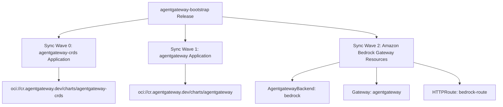

# Agentgateway Bootstrap Wrapper Chart Design Specification

## Overview
This document specifies the design for `agentgateway-bootstrap`, a Helm wrapper chart designed to deploy the [agentgateway](https://agentgateway.dev) control plane, CRDs, data plane gateway, and Amazon Bedrock LLM backend on Kubernetes via ArgoCD Applications.

## Architecture & Sync Waves

### Sync Wave Details
1. **Sync Wave 0**: `templates/agentgateway-crds-helm.yaml`
   - Installs `agentgateway-crds` chart from `oci://cr.agentgateway.dev/charts/agentgateway-crds`.
2. **Sync Wave 1**: `templates/agentgateway-helm.yaml`
   - Installs `agentgateway` control plane & proxy from `oci://cr.agentgateway.dev/charts/agentgateway`.
   - Uses `config/agentgateway-values.yaml` as values template.
3. **Sync Wave 2**: `templates/bedrock-backend.yaml`, `templates/gateway.yaml`, `templates/httproute.yaml`
   - Configures `AgentgatewayBackend` pointing to Amazon Bedrock (`ai.provider.bedrock`).
   - Configures Kubernetes `Gateway` resource for `agentgateway` class.
   - Configures `HTTPRoute` for OpenAI-compatible (`/v1/chat/completions`) and Bedrock (`/bedrock`) paths.

## Key Features & Configuration

- **Bedrock Integration**: Pre-configured Amazon Bedrock LLM backend (`amazon.nova-micro-v1:0` by default, customizable).
- **EnvironmentConfig Support**: Environment variable substitution for `${resourcePrefix}`, `${region}`, `${accountId}`.
- **IRSA / IAM Integration**: Optional IAM Role annotations for AWS IRSA.
- **ArgoCD Support**: Configurable ArgoCD project, destination namespace, and automated sync policies.

## File Map
- `Chart.yaml`: Chart metadata and versioning.
- `values.yaml`: Default configuration values.
- `config/agentgateway-values.yaml`: Config template evaluated by Helm for the upstream chart.
- `templates/_helpers.tpl`: Helm helper templates and label generators.
- `templates/agentgateway-crds-helm.yaml`: ArgoCD Application for CRDs.
- `templates/agentgateway-helm.yaml`: ArgoCD Application for control plane.
- `templates/bedrock-backend.yaml`: AgentgatewayBackend CR for Bedrock.
- `templates/gateway.yaml`: Gateway API resource.
- `templates/httproute.yaml`: Gateway API HTTPRoute resource.
- `README.md` & `README.md.gotmpl`: Helm documentation.
- `ct.yaml`: Update excluded-charts list.
