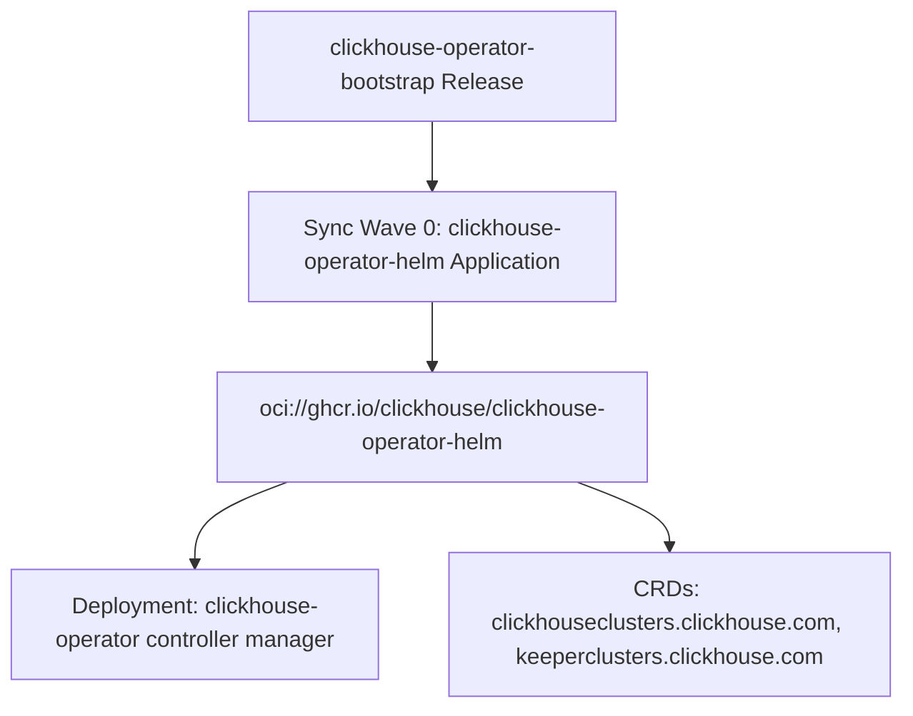

# ClickHouse Operator Bootstrap Chart Design Specification

## Overview
`clickhouse-operator-bootstrap` installs the [ClickHouse Kubernetes Operator](https://github.com/ClickHouse/clickhouse-operator) cluster-wide via an ArgoCD `Application`, mirroring the existing `cloudnative-pg-operator` chart's shape (single Application, no CRs of its own, cluster-scoped operator meant to be installed once per cluster). It exists as a standalone chart rather than being embedded in `langfuse-bootstrap` so any future consumer (not just Langfuse) can depend on the same cluster-wide operator installation without duplicating it.

## Why this operator
Langfuse's upstream `langfuse-k8s` chart (v2.0.0+) dropped its Bitnami ClickHouse subchart in favor of rendering `ClickHouseCluster`/`KeeperCluster` custom resources against this operator (`clickhouse.com/v1alpha1`). The operator's CRDs must exist in the cluster before the Langfuse chart is installed — the Langfuse chart preflights them (`clickhouse.crdCheck: true`) and fails fast otherwise.

## Prerequisites (not managed by this chart)
- **cert-manager**, cluster-wide. The operator's chart defaults `certManager.enabled: true` and creates its own `Certificate`/`Issuer` resources for webhook and metrics-endpoint TLS. This repo already assumes cert-manager is pre-installed cluster-wide (see `dex-issuer`, `otlp-gateway`, which create `Certificate` resources directly) — same assumption here, no cert-manager install step in this chart.

## Architecture & Sync Waves


- **Sync Wave 0**: `templates/clickhouse-operator-helm.yaml` — installs the operator's own Helm chart (OCI) into a dedicated namespace. There is only one template in this chart besides helpers.

## Upstream Chart Reference
- OCI ref: `oci://ghcr.io/clickhouse/clickhouse-operator-helm`
- Latest verified tag at design time: `v0.0.7` (confirmed via `gh api repos/ClickHouse/clickhouse-operator/tags`)
- Chart's own `Chart.yaml` reports `version: 0.0.1` / `appVersion: latest` — the OCI *tag* (`v0.0.7`) is what actually pins the release, matching how `agentgateway-bootstrap` pins `cr.agentgateway.dev/charts/*` via a `datasource=docker` Renovate annotation rather than a Helm-repo version.
- Relevant upstream values (verified from `dist/chart/values.yaml`): `manager.resources`, `manager.replicas`, `controller.watchNamespaces`, `rbac.namespaced`, `crd.enabled`/`crd.keep`, `certManager.enabled`, `webhook.enabled`. We pass through only `manager.resources` and `controller.watchNamespaces`; everything else stays at upstream defaults.

## Values Schema
```yaml
clickhouseOperatorChart:
  repoURL: oci://ghcr.io/clickhouse/clickhouse-operator-helm
  # renovate: datasource=docker depName=ghcr.io/clickhouse/clickhouse-operator-helm
  version: v0.0.7

argoProject: default

operator:
  namespace: clickhouse-operator-system
  # Empty = watch all namespaces (upstream default)
  watchNamespaces: []
  resources:
    requests:
      cpu: 10m
      memory: 64Mi
    limits:
      memory: 256Mi
```

## File Map
- `Chart.yaml` — chart metadata.
- `values.yaml` — defaults above.
- `templates/_helpers.tpl` — name/fullname/labels/`validateConfig` helpers, copied from `cloudnative-pg-operator`'s pattern (adjusted required-field checks: `argoProject`, `clickhouseOperatorChart.version`).
- `templates/clickhouse-operator-helm.yaml` — ArgoCD `Application` (sync-wave `"0"`), `CreateNamespace=true` + `ServerSideApply=true`, `automated: {prune: true, selfHeal: true}`.
- `README.md` / `README.md.gotmpl` — helm-docs generated, matching repo convention.

## Non-Goals
- No `ClickHouseCluster`/`KeeperCluster` CRs here — those are rendered by whichever consumer chart needs ClickHouse (`langfuse-bootstrap` in this case), since the operator is a shared cluster-wide dependency while the CR instances are per-consumer.
- No cert-manager installation.
