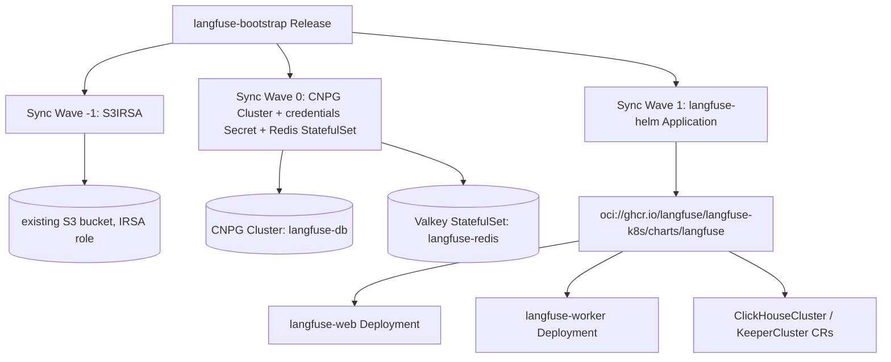

# Langfuse Bootstrap Wrapper Chart Design Specification

## Overview
`langfuse-bootstrap` deploys [Langfuse](https://langfuse.com/) (LLM engineering / observability platform) via ArgoCD, wrapping the upstream `langfuse-k8s` Helm chart (`oci://ghcr.io/langfuse/langfuse-k8s/charts/langfuse`, v2.0.0+). It follows the `agentgateway-bootstrap` / `loki-bootstrap` pattern: an ArgoCD `Application` per upstream chart, plus directly-templated resources for the pieces we own ourselves (CNPG Postgres, self-managed Redis, S3 IRSA).

All design decisions below were verified against the actual upstream chart source (`values.yaml`, `templates/_helpers.tpl`), not just its docs page.

## Dependency: ClickHouse Operator
Requires `clickhouse-operator-bootstrap` (separate chart, installed once per cluster) — see its own spec. `langfuse-bootstrap` does not install the operator; it only renders `ClickHouseCluster`/`KeeperCluster` CRs (via the upstream Langfuse chart's `clickhouse.deploy: true` path), which requires the operator's CRDs to already exist.

## Architecture & Sync Waves


### Sync Wave Details
1. **Sync Wave -1**: `templates/s3irsa.yaml` — `S3IRSA` CR (dip.io/v1alpha1) against an existing bucket, `allowRead`/`allowWrite`, targeting a ServiceAccount name we also configure on the Langfuse chart itself.
2. **Sync Wave 0**:
   - `templates/postgres-cluster.yaml` + `templates/postgres-secret.yaml` — CNPG `Cluster` (`langfuse-db`) + `basic-auth` Secret, same shape as `agentgateway-bootstrap`.
   - `templates/credentials-secret.yaml` — one Secret holding `salt`, `encryption-key`, `nextauth-secret`, `clickhouse-password`, `redis-password` (see "Credential pinning" below).
   - `templates/redis.yaml` — self-managed single-instance Valkey StatefulSet + Service, password sourced from the credentials Secret.
3. **Sync Wave 1**: `templates/langfuse-helm.yaml` — ArgoCD `Application` installing the upstream chart with `valuesObject` from `config/langfuse-values.yaml` (templated).

## Data Store Wiring (verified against upstream chart source)

### Postgres — CNPG
`postgresql.deploy: false`. Upstream supports `host` + `auth.existingSecret` + `auth.secretKeys.userPasswordKey` natively — **no patch-job needed** (unlike `agentgateway-bootstrap`, whose upstream chart has no such field and requires a Job to patch `AgentgatewayParameters` after the fact).
```yaml
postgresql:
  deploy: false
  host: "<cluster>-rw.<namespace>.svc.cluster.local"
  port: 5432
  auth:
    username: langfuse
    database: langfuse
    existingSecret: langfuse-db-credentials
    secretKeys:
      userPasswordKey: password
```
We create `langfuse-db-credentials` (`kubernetes.io/basic-auth`, keys `username`/`password`) ourselves and reference it from the CNPG `Cluster`'s `bootstrap.initdb.secret`, exactly like `agentgateway-bootstrap/templates/postgres-secret.yaml`.

### ClickHouse — rendered by the upstream chart itself
`clickhouse.deploy: true` (default) — the *Langfuse* chart renders the `ClickHouseCluster`/`KeeperCluster` CRs; we only need the operator's CRDs present (`clickhouse.crdCheck: true`, on by default, fails fast if missing).
```yaml
clickhouse:
  deploy: true
  crdCheck: true
  auth:
    existingSecret: langfuse-credentials
    existingSecretKey: clickhouse-password
  cluster:
    replicas: 1        # single node for minimal footprint; bump for HA
    storage:
      size: 20Gi
    resources:
      requests: { cpu: "500m", memory: 1Gi }
      limits: { memory: 2Gi }
  keeper:
    enabled: true      # required even for a single ClickHouse replica
    replicas: 1        # must be odd (1/3/5); 3 for production HA
    storage:
      size: 5Gi
```

### Redis — self-managed (per your goal note, not the upstream `valkey-io/valkey` subchart toggle)
`redis.deploy: false`. We deploy a single-instance `valkey/valkey` StatefulSet directly in this chart (same self-contained-StatefulSet style as `tempo-bootstrap/templates/tempo-kafka.yaml`), with `--requirepass` sourced from the shared credentials Secret via env, and `maxmemory-policy noeviction` set in a mounted `valkey.conf` — upstream's own README calls this setting **required**, otherwise Langfuse can lose queued jobs under memory pressure.
```yaml
redis:
  deploy: false
  host: "langfuse-redis.<namespace>.svc.cluster.local"
  port: 6379
  auth:
    username: default
    existingSecret: langfuse-credentials
    existingSecretPasswordKey: redis-password
```

### S3 — existing bucket via IRSA (no static keys)
`s3.deploy: false`. Verified in upstream `_helpers.tpl` (`langfuse.getS3ValueOrSecret`): when `accessKeyId`/`secretAccessKey` are both unset, the corresponding env vars are **omitted entirely** rather than set to empty strings — so the AWS SDK falls through to its default credential chain, which resolves via IRSA (`AWS_ROLE_ARN` / `AWS_WEB_IDENTITY_TOKEN_FILE`, injected by the pod-identity webhook) as long as the pod's ServiceAccount carries the right annotation. This is the exact same mechanism as `bedrock.auth.type: irsa` in `agentgateway-bootstrap` and the ServiceAccount pattern in `loki-bootstrap/templates/s3irsa.yaml`.
```yaml
s3:
  deploy: false
  storageProvider: s3
  bucket: "<substituted existingBucketName>"
  region: "${region}"
  forcePathStyle: false   # real S3, not SeaweedFS/MinIO — override upstream's true default
  # accessKeyId / secretAccessKey intentionally left unset — IRSA only

langfuse:
  serviceAccount:
    create: true
    name: "${resourcePrefix}-langfuse"
    annotations:
      eks.amazonaws.com/role-arn: "arn:aws:iam::${accountId}:role/${resourcePrefix}-langfuse-irsa-role"
```
Our `templates/s3irsa.yaml` creates the matching `S3IRSA` CR (`metadata.name` == `spec.serviceAccount.name` == `${resourcePrefix}-langfuse`, matching the 1:1 naming `loki-bootstrap` uses), which provisions the IAM role at the predictable `<name>-irsa-role` ARN — no `writeConnectionSecretToRef` consumption needed since there are no static keys to read (S3IRSA's connection secret carries only bucket metadata).

## Credential Pinning (critical — GitOps footgun avoided)
Upstream's README explicitly warns: tools that render via `helm template` (which is what ArgoCD does) cannot use Helm's `lookup`, so any left-empty "auto-generate on first install" value (`langfuse.salt`, `langfuse.encryptionKey`, `langfuse.nextauth.secret`, and the bundled datastores' auto-generated passwords) gets **regenerated on every sync** — rotating `salt` breaks all hashed API keys, rotating `encryptionKey` makes previously encrypted data unreadable. This is the same class of bug as the Grafana image-renderer token-drift issue seen elsewhere in this fleet.

Fix: one Secret (`langfuse-credentials`) templated from plain `values.yaml` string fields — same static-default convention as `agentgateway-bootstrap`'s `database.password: "agentgateway123"` — referenced via `secretKeyRef` everywhere upstream supports it. Values are stable across every ArgoCD sync because they come from the values file, not from randomness at render time.
```yaml
credentials:
  salt: "changeme-langfuse-salt"
  encryptionKey: "0123456789abcdef0123456789abcdef0123456789abcdef0123456789abcdef"
  nextauthSecret: "changeme-nextauth-secret"
  postgresPassword: "changeme-postgres-password"
  clickhousePassword: "changeme-clickhouse-password"
  redisPassword: "changeme-redis-password"
```
Documented in `values.yaml` comments: override every `credentials.*` field for any real deployment; the checked-in defaults are dev-only placeholders (same spirit as agentgateway's hardcoded default DB password).

Wired into the upstream chart's `valuesObject` as:
```yaml
langfuse:
  salt:
    secretKeyRef: { name: langfuse-credentials, key: salt }
  encryptionKey:
    secretKeyRef: { name: langfuse-credentials, key: encryption-key }
  nextauth:
    url: "http://localhost:3000"   # ClusterIP + port-forward; revisit if/when ingress is added
    secret:
      secretKeyRef: { name: langfuse-credentials, key: nextauth-secret }
```

## UI Exposure
ClusterIP only (`langfuse.web.service.type: ClusterIP`, upstream default) — verify the goal via `kubectl port-forward svc/langfuse-web 3000:3000 -n langfuse-system` and browsing to `http://localhost:3000`. No Ingress/HTTPRoute in this chart; revisit as a separate concern once auth/TLS/DNS are decided.

## Values Schema (top-level)
```yaml
langfuseChart:
  repoURL: oci://ghcr.io/langfuse/langfuse-k8s/charts
  # renovate: datasource=docker depName=ghcr.io/langfuse/langfuse-k8s/charts/langfuse
  version: 2.0.0

argoProject: default

environmentConfig:
  resourcePrefix: ""
  region: ""
  accountId: ""

namespace: langfuse-system

existingBucketName: ""   # required, supports ${resourcePrefix}/${region}/${accountId} substitution, same as loki-bootstrap

credentials: {}          # see above

database:                # CNPG
  instances: 1
  storage: { size: 5Gi }
  resources:
    requests: { cpu: 50m, memory: 128Mi }
    limits: { memory: 512Mi }

clickhouse:
  cluster: { replicas: 1, storage: { size: 20Gi }, resources: {...} }
  keeper: { replicas: 1, storage: { size: 5Gi } }

redis:
  image: { repository: valkey/valkey, tag: "8.0" }
  storage: { size: 4Gi }
  resources:
    requests: { cpu: 50m, memory: 128Mi }
    limits: { memory: 512Mi }

langfuse:
  nextauthUrl: "http://localhost:3000"
  web: { resources: {...} }
  worker: { resources: {...} }
```

## File Map
- `Chart.yaml`, `values.yaml`
- `config/langfuse-values.yaml` — templated `valuesObject` for the upstream chart.
- `templates/_helpers.tpl` — name/fullname/labels/`substituteVars`/`validateConfig`.
- `templates/s3irsa.yaml` — sync-wave `-1`.
- `templates/postgres-cluster.yaml`, `templates/postgres-secret.yaml` — sync-wave `0`.
- `templates/credentials-secret.yaml` — sync-wave `0`.
- `templates/redis.yaml` — StatefulSet + Service + ConfigMap (`valkey.conf`), sync-wave `0`.
- `templates/langfuse-helm.yaml` — ArgoCD `Application`, sync-wave `1`.
- `README.md` / `README.md.gotmpl`.

## Non-Goals
- No HA Postgres, no HA ClickHouse/Keeper, no Redis replication — single-instance everywhere, matching the "reach a functioning login" goal rather than production sizing. All the relevant replica counts are values knobs.
- No Ingress/HTTPRoute, no SSO/OIDC wiring, no SMTP.
- No migration path from any existing Bitnami-based Langfuse deployment (v1→v2 upstream migration guide applies if that's ever needed).

## Verification Plan
1. `helm template` both charts locally against a values file with a real `existingBucketName`/`environmentConfig`, confirm no template errors and expected `ClickHouseCluster`/`KeeperCluster`/`Cluster`/`Secret`/`StatefulSet` resources render.
2. Deploy `clickhouse-operator-bootstrap` to the homelab (or target) cluster, confirm operator pod ready and CRDs `Established`.
3. Deploy `langfuse-bootstrap`, watch ArgoCD sync waves resolve in order, confirm `Cluster` (CNPG), `ClickHouseCluster`, `KeeperCluster`, Valkey `StatefulSet`, and `langfuse-web`/`langfuse-worker` all reach Ready.
4. `kubectl port-forward svc/langfuse-web 3000:3000 -n langfuse-system`, browse to `http://localhost:3000`, confirm the login screen renders and a sign-up/login round-trip succeeds (goal condition).
